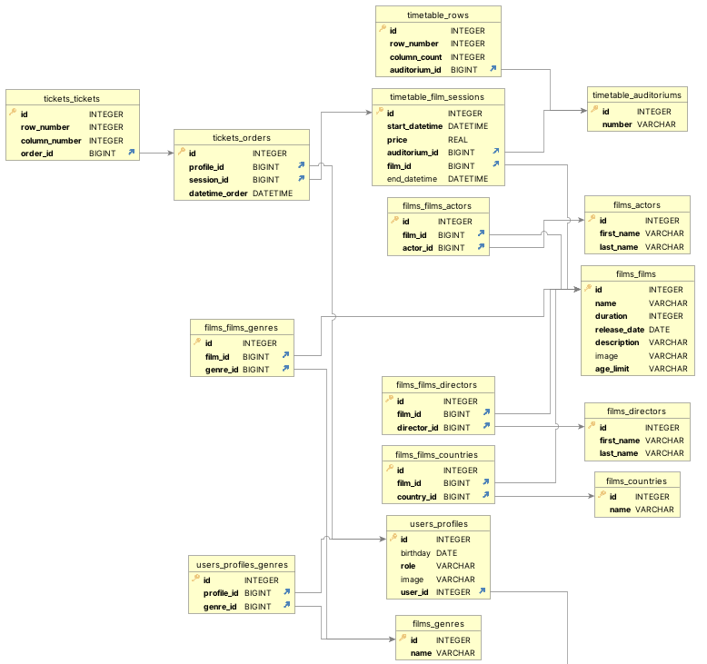

# CineCync

Проект представляет собой интерфейс для работы с системой кинотеатра

## Инструкция к локальному запуску

1) Скачать проект или склонировать репозиторий:

    ```bash
    clone https://github.com/omixyy/MSU_aerosol_site
    ```

2) Создать виртуальное окружение:

    ```bash
    python3 -m venv venv
    ```

3) Активировать его:

    ```bash
    source venv/bin/activate
    ```

4) Установить зависимости:

    - Для разработки:

        ```bash
        pip3 install -r requirements/dev.txt
        ```

    - Для тестирования:

        ```bash
        pip3 install -r requirements/test.txt
        ```

    - Для продакшена:

        ```bash
        pip3 install -r requirements/prod.txt
        ```

5) Применить миграции:

    ```bash
    python3 manage.py makemigrations
    python3 manage.py migrate
    ```

6) Создать профиль админа:

    ```bash
    python3 manage.py createsuperuser
    ```

7) Запуск:

    ```bash
    cd CineCync
    python3 manage.py runserver
    ```

## База данных

На диаграмме ниже представлена схема базы данных

